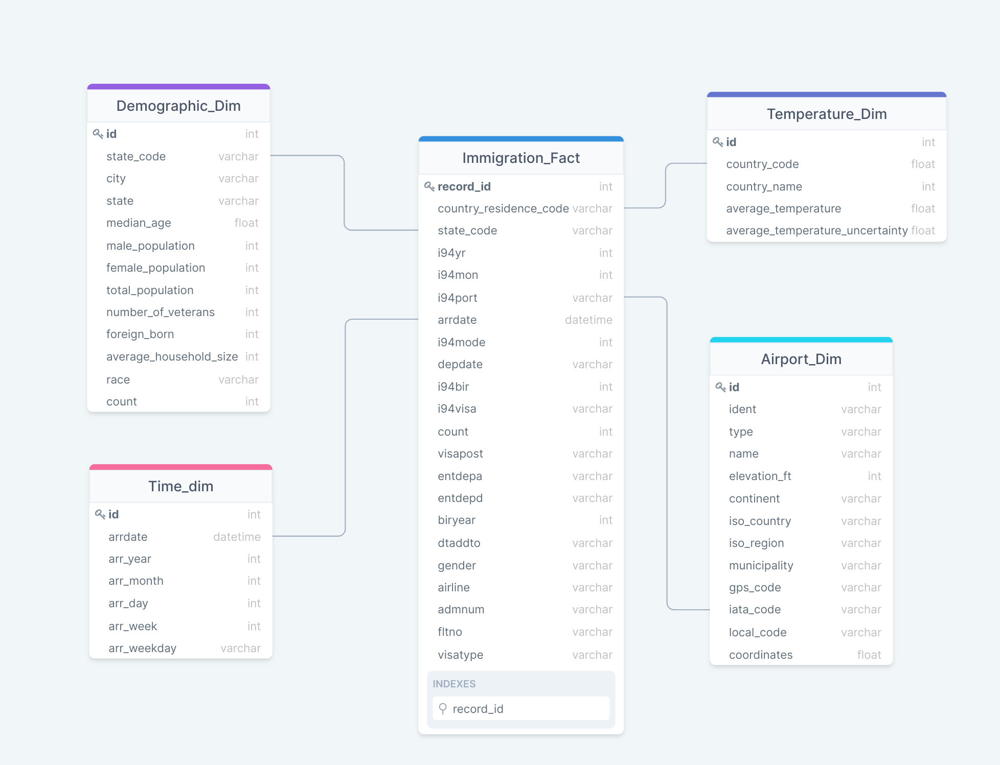

# Project description: 
In the Udacity provided project, we'll work with four datasets to complete the project. The main dataset will include data on immigration to the United States, and supplementary datasets will include data on airport codes, U.S. city demographics, and temperature data.

# Database design: 

# ETL Process:
The ETL Process includes the following steps: 
The project follows the follow steps:

Step 1: Scope the Project and Gather Data
Step 2: Explore and Assess the Data
Step 3: Define the Data Model
Step 4: Run ETL to Model the Data
Step 5: Complete Project Write Up

## Step 1: Scope the Project and Gather Data
Since the scope of the project will be highly dependent on the data, these two things happen simultaneously. In this step, you’ll:

Identify and gather the data you'll be using for your project (at least two sources and more than 1 million rows). See Project Resources for ideas of what data you can use.
Explain what end use cases you'd like to prepare the data for (e.g., analytics table, app back-end, source-of-truth database, etc.)
## Step 2: Explore and Assess the Data
Explore the data to identify data quality issues, like missing values, duplicate data, etc.
Document steps necessary to clean the data
## Step 3: Define the Data Model
Map out the conceptual data model and explain why you chose that model
List the steps necessary to pipeline the data into the chosen data model
## Step 4: Run ETL to Model the Data
Create the data pipelines and the data model
Include a data dictionary
Run data quality checks to ensure the pipeline ran as expected
Integrity constraints on the relational database (e.g., unique key, data type, etc.)
Unit tests for the scripts to ensure they are doing the right thing
Source/count checks to ensure completeness
## Step 5: Complete Project Write Up
What's the goal? What queries will you want to run? How would Spark or Airflow be incorporated? Why did you choose the model you chose?
Clearly state the rationale for the choice of tools and technologies for the project.
Document the steps of the process.
Propose how often the data should be updated and why.
Post your write-up and final data model in a GitHub repo.
Include a description of how you would approach the problem differently under the following scenarios:
If the data was increased by 100x.
If the pipelines were run on a daily basis by 7am.
If the database needed to be accessed by 100+ people.

# How To Run the Project: 
Steps to run the project includes: 
    - Drop and Creates tables using file create_tables.py
    - Run file etl.py to process and insert data into different tables and save as parquet file in S3
